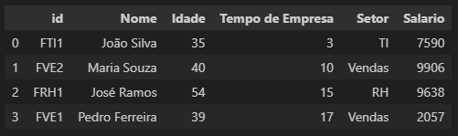

# 7 maneiras de criar DataFrames no Pandas


### Apresentação
Neste exemplo será demonstrada 7(sete) formas de criar DataFrames no pandas:
<a id="menu"></a>
1. [A partir de um arquivo CSV](#ancora1)
2. [A partir de uma planilha Excel (xlsx)](#ancora2)
3. [A partir da área de transferência](#ancora3)
4. [A partir de um dicionário (objeto)](#ancora4)
5. [Combinando linhas de diferentes DataFrames](#ancora5)
6. [Combinando colunas de diferentes DataFrames](#ancora6)
7. [Juntando DataFrames com merge](#ancora7)

### Arquivos de exemplo utilizados no projeto
- [cereal.csv](cereal.csv)
- [cereal.xlsx](cereal.xlsx)

> Se preferir, os arquivos podem ser baixados diretamente do site do [Kaggle](https://www.kaggle.com/datasets/crawford/80-cereals?resource=download)

- [Download dos arquivos](
https://www.kaggle.com/datasets/crawford/80-cereals?resource=download)

# Baixando e instalando dependências:

### Passo 1
Primeiramente, faça o download do projeto:
```sh
git clone https://github.com/andviana/dataframes_examples.git
```

### Passo 2
Agora, entre na pasta do projeto e abra a sua IDE (os comandos abaixo abrirão o Visual Studio Code na pasta raiz do projeto)
```sh
cd dataframes_examples
code .
```

### Passo 3 (opcional)
Se precisar criar um ambiente virtual, no terminal, execute os comandos:
> *a criação do venv é um passo necessário no **Ubuntu 24**, bem como em outras distros linux*
```sh
python3 -m venv .venv
source .venv/bin/activate
```
Para desativar o ambiente virtual (venv), use o comando abaixo:
> *não execute esse comando agora, pois caso seja o venv seja desativado, problemas podem ocorrer ao tentar instalar as dependências do projeto com o* ```pip```
```sh
deactivate
```

### Passo 4
No terminal do seu IDE, execute a instalação do [Pandas](https://pandas.pydata.org/docs/user_guide/index.html) conforme comando abaixo:
```sh
pip install pandas
pip install openpyxl
pip install numpy
```


# Execução dos Exemplos:
<a id="ancora1"></a>
### 1. [A partir de um arquivo](#menu)
```python
import pandas as pd
base_csv = pd.read_csv('cereal.csv')
base_excel.head()
``` 


<a id="ancora2"></a>
### 2. [Importar a partir de uma planilha](#menu)
```python
base_excel = pd.read_excel('cereal.xlsx')
base_excel.head()
```


<a id="ancora3"></a>
### 3. [A partir da área de transferência](#menu)
```python
# copiar dados do excel antes de executar a linha abaixo
df_transferencia = pd.read_clipboard()
df_transferencia.head()
```


<a id="ancora4"></a>
### 4. [A partir de um dicionário (objeto)](#menu)
```python
funcionarios = {
    'Nome' : ['João Silva', 'Maria Souza', 'José Ramos', 'Pedro Ferreira'],
    'Idade' : [35, 40, 54, 39],
    'Tempo de Empresa' : [3, 10, 15, 17], 
}

print(funcionarios)
base_dicionario = pd.DataFrame(funcionarios)

base_dicionario.head()
```


<a id="ancora5"></a>
### 5. [Combinando linhas de diferentes DataFrames](#menu)
```python
mais_funcionarios = {
    'Nome' : ['Paula Lima', 'Marta Nunes'],
    'Idade' : [28, 45],
    'Tempo de Empresa' : [5, 12],
}

print(mais_funcionarios)
base_mais_funcionarios = pd.DataFrame(mais_funcionarios)

base_mais_funcionarios.head()

# juntando os dois DataFrames de funcionarios
base_funcionarios = pd.concat([base_dicionario, base_mais_funcionarios], ignore_index=True)

base_funcionarios.head()
```


<a id="ancora6"></a>
### 6. [Combinando colunas de diferentes DataFrames](#menu)
```python
# gerando uma base de valores aleatórios com numpy
import numpy as np

setores = ['Vendas', 'RH', 'TI']

dados_funcionarios = {
    'Setor': np.random.choice(setores, 6),
    'Salario': np.random.randint(2000, 10000, 6)
}

print(dados_funcionarios)

base_dados_funcionarios = pd.DataFrame(dados_funcionarios)
base_dados_funcionarios.head()

# combinando os valores setor e salário com a base de funcionários
base_colunas_combinadas = pd.concat([base_funcionarios, base_dados_funcionarios], axis='columns')
base_colunas_combinadas.head()
```


<a id="ancora7"></a>
## 7. [Juntando DataFrames com merge](#menu)
```python
funcionarios = {
    'id' : ['FTI1', 'FVE2', 'FRH1', 'FVE1'],
    'Nome' : ['João Silva', 'Maria Souza', 'José Ramos', 'Pedro Ferreira'],
    'Idade' : [35, 40, 54, 39],
    'Tempo de Empresa' : [3, 10, 15, 17], 
}

base_funcionarios = pd.DataFrame(funcionarios)
base_funcionarios.head()

dados_funcionarios = {
    'id' : ['FVE1', 'FRH1', 'FTI1', 'FVE2'],
    'Setor' : ['Vendas', 'RH', 'TI', 'Vendas'],
    'Salario' : np.random.randint(2000,10000, size=4),
}

base_dados_funcionarios = pd.DataFrame(dados_funcionarios)
base_dados_funcionarios.head()

base_merge = pd.merge(
    base_funcionarios, 
    base_dados_funcionarios,
    on='id'
)

base_merge.head()
```



### Referências
- [Biblioteca Pandas](https://pandas.pydata.org/docs/user_guide/index.html) 
- [Hashtag Treinamentos](https://www.youtube.com/watch?v=4fSCEcMYyLc)

